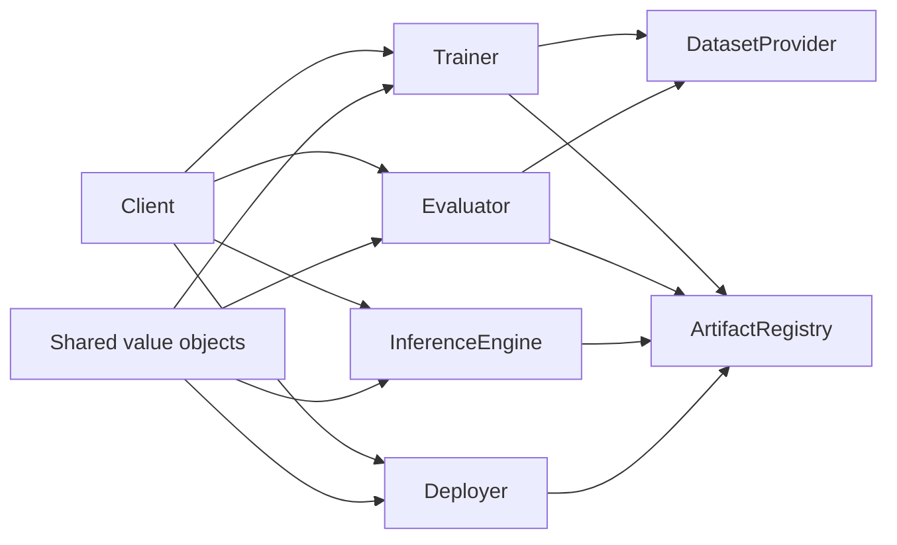

# Architecture

The immutable value objects form the common vocabulary. Runtime-specific
components structurally implement the public protocols.

Protocols use structural typing, so adapters do not need to inherit from a base
class. `runtime_checkable` supports lightweight integration checks, while static
type checkers validate complete method signatures.
